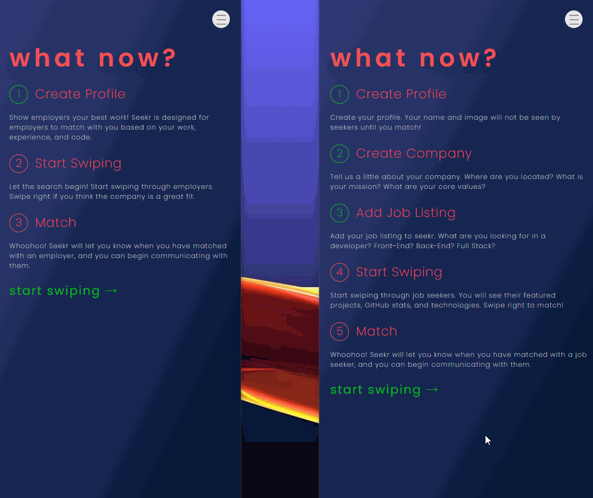
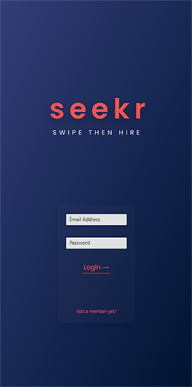
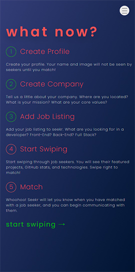
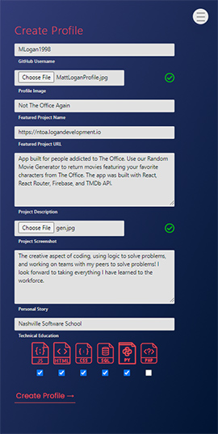

# Seekr :mag_right:

## Back End Capstone
### Nashville Software School, Evening Cohort 12

**Seekr** is a Tinder-like app built for junior developers and employers to match with one another. Unlike Tinder, employers and seekers will not see each others personal data until after they have matched. Employers will judge seekers based on their projects, code, tech stack, education, etc. After matching, the employer and seeker have the ability to chat with one another in real time. 

**Seekr** is a full-stack app built with React, Python and the Django REST Framework. View the [back-end repository here.](https://github.com/MLogan1998/seekr-api)

## Features:
* **Authentication**: Log In and Register using Django Token Authentication. 
* **User-Types**: Seekr supports two user-types, Seekr and Employer. 
* **User Experience**: User experince on the app was a top priority. Making the on-boarding experience, and progress through the app as simple and intuitive as possible. 
* **Create Profile**: Input your data, select your technologies, and upload images from your device to complete your profile and/or job listing.
* **Swipe**: As an employer you will swipe through developer profiles. You will have the ability to view their featured project, a brief bio, tech stack, and view their code via recent pull requests. As a seeker you will swipe through job listings, You will see job description, requirements, company bio, and salary details. Swipe right to match! 
* **Match**: If a seeker and employer swipe right on one another they will match, and be notified. Visit the Match section of the app to view all of your matches. 
* **Real-Time Chat**: Seekers and employers have the ability to chat with one another in real time after matching. This feature is supported by Firebase Firestore. 
* **Mobile-First Design**: As the app was built with the mobile experience top of mind, it was designed using moblile-first principles. 

## Screenshots:
#### Swipe/Match/Chat:

#### Log In: 

#### Employer Home Screen:

#### Creater Seeker Profile: 

## Contact:
#### Portfolio: [Logan Development](https://logandevelopment.io)
#### Linked In: [Connect on LinkedIn](www.linkedin.com/in/mlogan5212)
#### Front-End Capstone: [Not The Office Again](https://ntoa.logandevelopment.io)
